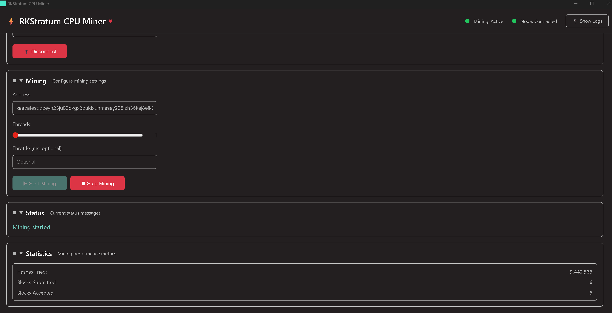
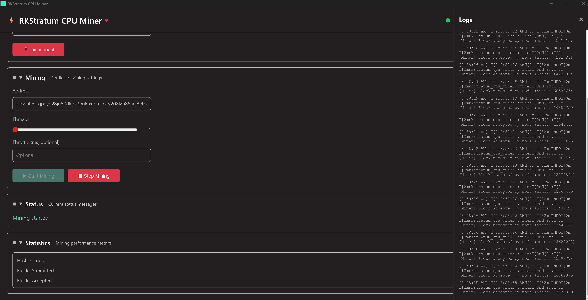

# RKStratum CPU Miner

A standalone, native desktop application for CPU mining on Kaspa Testnet 12 (TN12). Built with Tauri v2 for a modern, cross-platform GUI experience.

## Features

- 🖥️ **Native Desktop GUI** - Built with Tauri v2, modern and responsive
- ⚡ **Optimized Mining** - High-performance CPU mining with multi-threading, optimized for high BPS networks
- 📊 **Real-time Stats** - Live hashrate, blocks found, and mining metrics
- 📝 **Real-time Logs** - View detailed logs from the miner in real-time
- 🔌 **Node Connection** - Connect to any Kaspa node via gRPC
- 🎯 **Easy Setup** - Simple GUI to configure mining address and settings

## Screenshots

### Main Interface


The main interface showing the mining configuration panel with address input, threads slider, throttle settings, and control buttons. Status indicators show "Mining: Active" and "Node: Connected" with green indicators. The Statistics section displays real-time metrics including hashes tried, blocks submitted, and blocks accepted.

### Logs Panel


The logs panel displaying real-time mining activity. Shows timestamped log entries with "Block accepted by node" messages, including nonce values for successfully mined blocks. The panel can be toggled using the "Show Logs" button in the header.

## Requirements

- Rust (latest stable)
- Node.js (v20+) - Required for Tauri frontend build
- A running Kaspa node (kaspad) or connection to one

## Building

### Prerequisites

1. Install Rust: https://rustup.rs/
2. Install Node.js: https://nodejs.org/ (v20+)
3. Install Tauri CLI: `cargo install tauri-cli`

### Build Steps

```bash
# Clone the repository
git clone <your-repo-url>
cd kaspa-cpu-miner-gui

# Build the application (release mode)
cargo tauri build

# Or run in development mode
cargo tauri dev
```

The built application will be in:
- **Windows**: `src-tauri/target/release/bundle/nsis/RKStratum CPU Miner_0.1.0_x64-setup.exe`
- **Windows (MSI)**: `src-tauri/target/release/bundle/msi/RKStratum CPU Miner_0.1.0_x64_en-US.msi`

## Dependencies

This project uses git dependencies from the [rusty-kaspa tn12 branch](https://github.com/kaspanet/rusty-kaspa/tree/tn12). All Kaspa crates are fetched directly from GitHub, so you don't need a local copy of the rusty-kaspa workspace.

The following Kaspa crates are used:
- `kaspa-consensus-core`
- `kaspa-hashes`
- `kaspa-pow`
- `kaspa-rpc-core`
- `kaspa-grpc-client`
- `kaspa-notify`
- `kaspa-addresses`

## Usage

1. Launch the application
2. Enter the node address (default: `127.0.0.1:16210`)
3. Click "Connect" to connect to the node
4. Enter your Kaspa Testnet 12 mining address (e.g., `kaspatest:...`)
5. Configure thread count and throttle settings (optional)
6. Click "Start Mining" to begin mining
7. View real-time statistics in the stats panel
8. Click "Show Logs" to view detailed mining logs

## Project Structure

```
rkstratum-cpu-miner/
├── src/                    # Frontend (HTML/CSS/JavaScript)
│   ├── index.html         # Main HTML structure
│   ├── styles.css         # Styling
│   └── main.js            # Frontend logic
├── src-tauri/             # Backend (Rust)
│   ├── src/
│   │   ├── main.rs        # Tauri app entry point
│   │   ├── api.rs         # Kaspa node API client
│   │   └── miner.rs       # CPU miner implementation
│   ├── Cargo.toml         # Rust dependencies
│   └── tauri.conf.json    # Tauri configuration
└── README.md              # This file
```

## Mining Optimizations

The miner implementation includes several performance optimizations from `rkstratum_cpu_miner.rs`:

- **Batch hash counting**: Updates atomic counter every 1000 hashes instead of every hash
- **Reduced lock contention**: Checks for work updates every 200 hashes
- **Optimized hot path**: Minimizes branches and checks in the inner mining loop
- **Better nonce distribution**: Uses thread count as step size for optimal coverage
- **Throttle optimization**: Uses bitwise operations instead of modulo
- **Fast work detection**: 50ms template poll interval for high BPS networks like TN12

## Notes

- The miner code is based on `rusty-kaspa/bridge/src/rkstratum_cpu_miner.rs`
- The API client is simplified from `rusty-kaspa/bridge/src/kaspaapi.rs`
- Uses **Tauri v2** for the desktop application framework
- All Kaspa dependencies are fetched from the `tn12` branch on GitHub
- Optimized for Testnet 12 (TN12) with 10 BPS

## License

MIT
